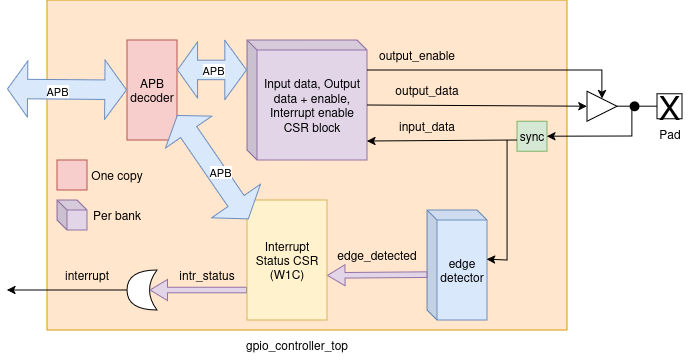

********
Overview
********

Block Diagram
=============

Dataflow
========

None

Clocks and clock domains
========================

.. list-table:: Clocks
   :widths: 20 20 60
   :class: longtable
   :header-rows: 1

   * - Clock Name
     - Clock Signal
     - Description
   * - clk
     - clk
     - Main clock

Resets and reset domains
========================

.. list-table:: Resets
   :widths: 20 20 60
   :class: longtable
   :header-rows: 1

   * - Reset Name
     - Reset Signal
     - Description
   * - rst_n
     - rst_n
     - Main reset

Power domains
=============

The design only have one power domain.
