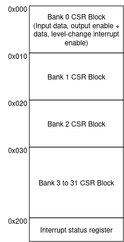

******************
Software Interface
******************

Address Space
=============

The register space of this GPIO controller IP is accessable through APB interface. It consumes 1024 bytes of address space. The first half of the address space is organized as 32 blocks of 16 bytes. Each 16 byte is assigned to an IO bank. Thus the base address of an IO bank can be calculated with `16*b`. The interrupt status register is located at address 0x200.

Control and Status Register
===========================

Each IO bank contains 4 registers, refer to SystemRDL file for more info.

Interrupts
==========

This IP provide one active-high async level interrupt signal.

DMA
===

None

Virtualization
==============

None
